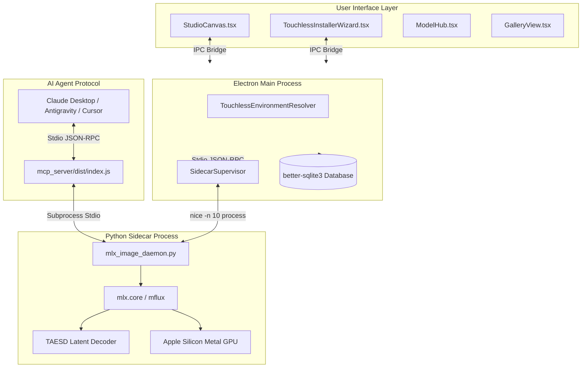
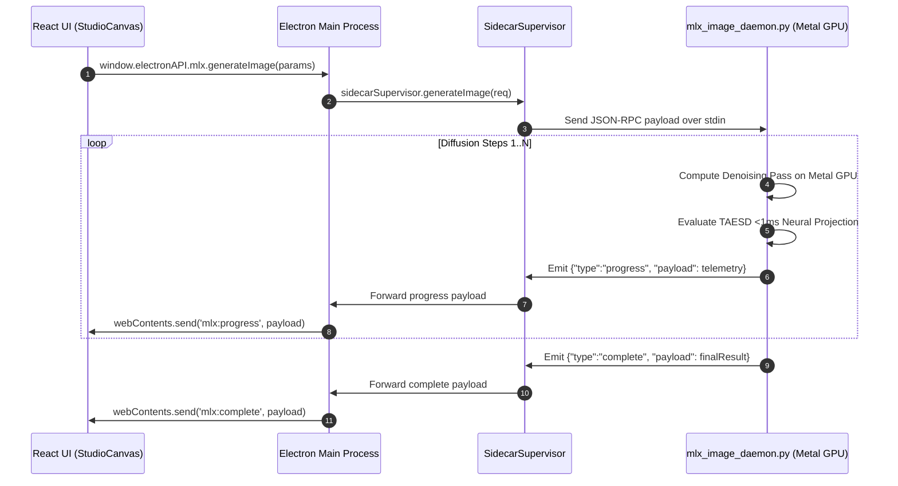

# 🏛️ DreamBees MLX System Architecture

This document details the internal system architecture, IPC sequence flows, process supervision, and memory management algorithms in **DreamBees MLX Studio** (mirrored from architectural documentation in projects like Ollama, vLLM, and Electron).

---

## 📐 System High-Level Topology

---

## ⚡ Stdio JSON-RPC Sequence Flow

---

## 💾 Memory & Fluidity Management

1. **Unified Memory Cache Capping**:
   - `mx.set_cache_limit(3 * 1024 * 1024 * 1024)` caps MLX cache at 3GB, preventing VRAM starvation.
2. **Process Scheduling Priority**:
   - Spawns the sidecar process using `nice -n 10` on macOS to guarantee 60 FPS WindowServer and UI responsiveness.
3. **MemorySaver Weight Eviction**:
   - T5 and CLIP text encoder weights are automatically evicted from Unified Memory immediately following prompt token encoding.
