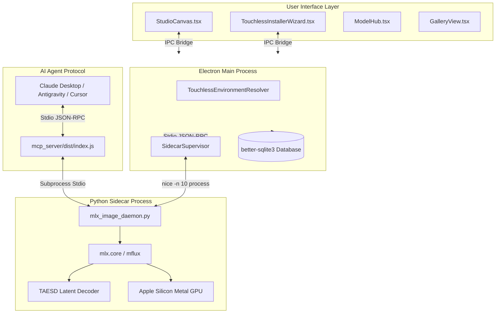
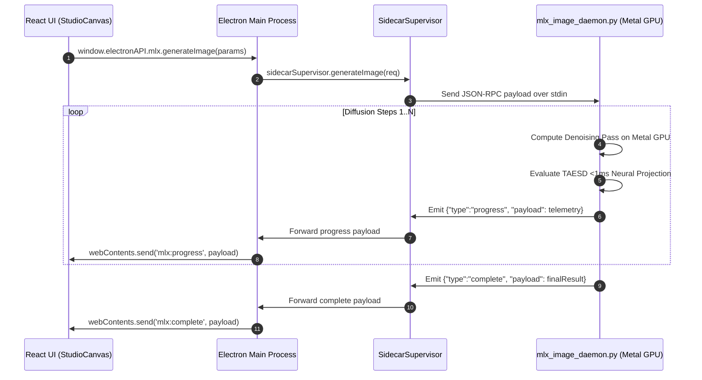

# 🏛️ DreamBees MLX System Architecture

This document details the internal system architecture, IPC sequence flows, process supervision, and memory management algorithms in **DreamBees MLX Studio** (mirrored from architectural documentation in projects like Ollama, vLLM, and Electron).

---

## 📐 System High-Level Topology

---

## ⚡ Stdio JSON-RPC Sequence Flow

---

## 💾 Memory & Fluidity Management Architecture

1. **Unified Memory Cache & Pipeline Caching**:
   - `mx.set_cache_limit(3 * 1024 * 1024 * 1024)` caps MLX cache at 3GB, preventing VRAM starvation.
   - Global model pipeline caching (`_LOADED_MODELS`) in `mlx_image_daemon.py` reuses initialized weights in Metal Unified Memory across generations.
   - Post-generation `mx.clear_cache()` and Python `gc.collect()` return unallocated Metal VRAM pages to macOS.

2. **Process Supervision & Line-Buffered Streams**:
   - Spawns the sidecar process using `nice -n 10` on macOS to guarantee 60 FPS WindowServer and UI responsiveness.
   - Stream data parsing via `stdoutBuffer` line accumulator in `SidecarSupervisor` prevents unparsed JSON drops across chunk boundaries.
   - Complete process handle teardown (`removeAllListeners()`) on `stdout`, `stderr`, `stdin`, and `ChildProcess` instances on exit.

3. **Electron Main IPC & Log Queue Safety**:
   - Singleton IPC message binding (`ensureSidecarSupervisor()`) attaches supervisor listeners once at startup, eliminating `MaxListenersExceededWarning` leaks.
   - Main process `logQueue` is capped at 500 items with overflow eviction (`logQueue.shift()`) to prevent V8 heap string growth.

4. **Anti-Disk Erosion SQLite Persistence**:
   - **Base64 Externalization**: Saves base64 images as standalone PNG files under `userData/generations/`, keeping SQLite rows lightweight (~200 bytes).
   - **2 GB LRU Byte-Quota Engine**: Enforces strict 2 GB cache storage limit, evicting oldest LRU files when cache exceeds budget down to 80% quota (1.6 GB).
   - **Atomic File Swapping**: Implements `.tmp` writes + `fsyncSync` + atomic `renameSync` to eliminate corrupt 0-byte PNG files on crash.
   - **WAL Journaling & Vacuuming**: Runs WAL checkpoints (`WAL_CHECKPOINT_TRUNCATE`) and periodic `VACUUM` to prevent DB bloat.

5. **React DOM Memory & Lifecycle Cleanup**:
   - **IPC Subscription Teardown**: `window.electronAPI.mlx.onProgress` and `onComplete` return cleanup functions inside `useEffect`.
   - **Preview State Eviction**: Caps `stepHistory` preview array to 16 items and clears Base64 preview state on unmount/completion.
   - **Asynchronous Image Decoding**: `loading="lazy"` and `decoding="async"` prevent browser V8 from decoding offscreen images into bitmap memory simultaneously.
   - **Unmount Cancellation Flags**: Component unmount guards (`mountedRef.current`) prevent state mutations on unmounted React components.
