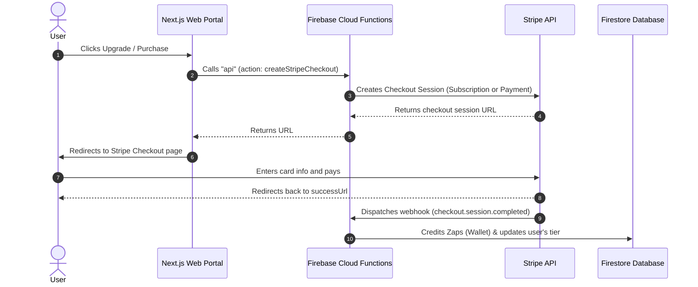

# 💳 Stripe Integration Guide for DreamBees

This guide provides step-by-step instructions for configuring, testing, and deploying the Stripe payment system for the **DreamBees** web and desktop applications.

---

## 🗺️ Architectural Overview

DreamBees integrates with Stripe to handle subscription upgrades, credits (Zaps) purchases, and customer portal billing.



---

## 1. 🛍️ Stripe Dashboard Setup

To map payment flows correctly, you must register the specific products and prices in your **Stripe Dashboard** (in either Test Mode or Live Mode).

### A. Create Subscription Plans
Create the following recurring products and copy their **Price IDs** (not product IDs):

1. **Alchemist Pro** (Pro Tier)
   - **Type**: Recurring / Subscription
   - **Price**: `$29.00 / month`
   - **Required Price ID**: `price_1TeOk1IA2zQnWbn5V7GsiAB6`
   - **Benefit**: Grants **500 Zaps** on activation and renewal.

2. **Architect Pro** (Architect Tier)
   - **Type**: Recurring / Subscription
   - **Price**: `$99.00 / month`
   - **Required Price ID**: `price_1TeOk1IA2zQnWbn5YbTvD7Oj`
   - **Benefit**: Grants **2500 Zaps** on activation and renewal.

### B. Create One-Time Zap Packs
Create the following one-time products:

1. **Starter Pack**
   - **Price**: `$4.99` (one-time)
   - **Required Price ID**: `price_1TeOk2IA2zQnWbn5v0I8HQYB`
   - **Benefit**: Grants **50 Zaps**.

2. **Pro Booster**
   - **Price**: `$9.99` (one-time)
   - **Required Price ID**: `price_1TeOk3IA2zQnWbn5u8JeE7Z0`
   - **Benefit**: Grants **120 Zaps**.

3. **Studio Vault**
   - **Price**: `$19.99` (one-time)
   - **Required Price ID**: `price_1TeOk3IA2zQnWbn569bphdyX`
   - **Benefit**: Grants **300 Zaps**.

4. **Infinite Source**
   - **Price**: `$49.99` (one-time)
   - **Required Price ID**: `price_1TeOk4IA2zQnWbn5FpxaymDB`
   - **Benefit**: Grants **900 Zaps**.

### C. Configure Customer Portal
To allow users to cancel or change subscriptions:
1. In Stripe, go to **Settings** > **Billing** > **Customer Portal**.
2. Enable features like "Allow customers to cancel subscriptions".
3. Save changes. Stripe manages the UI entirely.

---

## 2. 🔑 Environment Variables Configuration

Copy the keys from your Stripe dashboard and configure them in your environment files.

### Cloud Functions (`functions/.env`)
Ensure the following keys are present in `/functions/.env` for runtime execution:

```ini
STRIPE_SECRET_KEY=sk_test_51...
STRIPE_PUBLISHABLE_KEY=pk_test_51...
STRIPE_WEBHOOK_SECRET=whsec_...
```

*Note: For production, these can be set via Firebase Secrets or standard environment variables.*

---

## 3. 💻 Local Webhook Testing & Emulation

Since Stripe webhooks are triggered from Stripe's servers to yours, you need to use the **Stripe CLI** to tunnel events during local development.

### Step 1: Install Stripe CLI
Install via Homebrew:
```bash
brew install stripe/stripe-cli/stripe
```

### Step 2: Authenticate the CLI
Log in to your Stripe account:
```bash
stripe login
```
*This opens a browser window to authorize your CLI session.*

### Step 3: Run the Firebase Emulator
Start the Cloud Functions emulator in the `functions/` directory:
```bash
cd functions
npm run serve
```
Make note of the local port. Usually, the functions emulator runs on `http://127.0.0.1:5001`.

### Step 4: Forward Webhooks
Start forwarding Stripe events to the local `web` Cloud Function:
```bash
stripe listen --forward-to http://127.0.0.1:5001/dreambees-alchemist/us-central1/web/stripe-webhook
```
*(Replace `dreambees-alchemist` with your actual Firebase project ID configured in `.firebaserc`.)*

### Step 5: Update Webhook Secret
The `stripe listen` command will print a local webhook secret:
```text
> Ready! Your webhook signing secret is whsec_1234567890abcdef...
```
Copy this secret and paste it as the `STRIPE_WEBHOOK_SECRET` inside `/functions/.env`. Restart the Firebase emulator to pick up the change.

---

## 4. 🧪 Manual Testing Workflows

Once the CLI is listening and the emulator is running, you can test the entire checkout lifecycle.

### Testing Subscriptions
1. Log in to the Next.js portal (`web` dev server).
2. Go to the pricing page `/pricing`.
3. Click "Upgrade" on **Alchemist Pro**.
4. You will be redirected to the Stripe Checkout page.
5. Use a Stripe test card (e.g., `4242 4242 4242 4242` with any future expiry and CVV).
6. Complete the checkout.
7. Observe the Stripe CLI logs:
   - `checkout.session.completed` event will be captured and forwarded.
8. Check your Firestore database:
   - The user's document under `users/{uid}` should now have:
     - `subscriptionStatus: "active"`
     - `tier: "pro"`
     - `stripeCustomerId: "cus_..."`
     - Their Zaps wallet balance should increase by **500 Zaps**.

### Testing One-Time Zap Purchases
1. On `/pricing`, scroll down to the "Zap Packs" section.
2. Select the **Pro Booster** (120 Zaps / $9.99).
3. Complete the checkout session.
4. Check the Firestore wallet/user records:
   - Zaps balance should increase by **120 Zaps**.

### Testing Subscription Cancellations
1. Go to the dashboard settings tab or click the billing link to open the Customer Portal.
2. Click "Cancel Subscription".
3. Check Firestore:
   - The Stripe webhook triggers a `customer.subscription.deleted` event.
   - The user's document should update to `subscriptionStatus: "inactive"` and `tier: "free"`.

---

## 🛡️ Production Checklist

> [!WARNING]
> Before deploying your app live:
> 1. Switch Stripe Dashboard to **Live Mode**.
> 2. Re-create all Products & Prices in Live Mode, and update the Price IDs in the code.
> 3. Register the production webhook URL in Stripe (e.g. `https://us-central1-dreambees-alchemist.cloudfunctions.net/web/stripe-webhook`).
> 4. Guard your keys! Never commit production Stripe keys (`sk_live_...`) to version control. Set them as environment variables or use Firebase Secret Manager.
