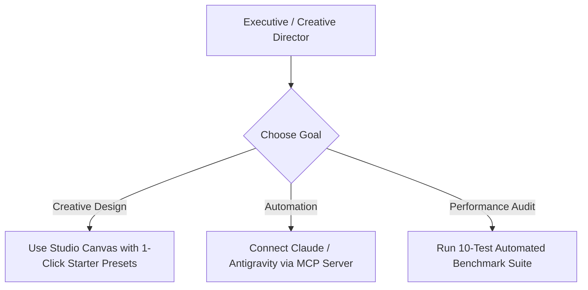

# 💼 Stakeholder & Executive Onboarding Guide

Welcome to **DreamBees MLX Studio** — an enterprise-ready, 100% sovereign, on-device AI Image Generation Studio and Model Context Protocol (MCP) Engine engineered exclusively for Apple Silicon Macs.

This document outlines the strategic value, privacy posture, financial ROI, and workflow capabilities for **Product Managers**, **Creative Directors**, **Executive Sponsors**, and **Security Officers**.

---

## 🎯 Executive Value Proposition

| Strategic Pillar | Cloud API Model (Legacy) | DreamBees MLX Model (Sovereign) |
|---|---|---|
| **Privacy & Security** | Data sent to remote third-party servers | **100% On-Device** • Zero data leaves the Mac |
| **API Costs** | $0.02 – $0.10 per image ($1,000s/mo) | **$0.00** • Unlimited generations forever |
| **Vendor Lock-in** | Subject to API rate limits & outages | **Offline-First** • Works 100% offline without internet |
| **AI Agent Integration** | Complex API key rotation & proxies | **Native MCP Server** • Direct AI agent control |
| **Hardware Efficiency** | Unused local GPU hardware | **Native Apple Silicon Metal** acceleration |

---

## 🛡️ Privacy, Security, & Compliance

1. **Zero Data Egress**:
   - Prompts, intermediate latent tensors, and final generated images never leave the user's local Apple Silicon Mac.
   - Fully compliant with strict corporate privacy mandates (HIPAA, GDPR, SOC 2, IP secrecy).

2. **Copyright & Asset Ownership**:
   - All generated artwork is saved locally to on-device disk (`~/Library/Application Support/DreamBees Lite/generations/`).
   - You retain 100% ownership of your prompts, fine-tuned weights, and output image assets without third-party licensing restrictions.

---

## 💰 Financial ROI & Cost Elimination

- **Zero Cloud API Subscriptions**: Eliminates recurring billing for cloud image services (Midjourney, DALL-E 3, Stable Diffusion Cloud API).
- **Repurposing Existing Apple Hardware**: Leverages existing M1/M2/M3/M4 MacBooks, Mac Studios, and Mac Minis with Unified Memory.

---

## 🚀 Key Stakeholder Workflows

1. **Creative Team Workflow**:
   - Designers launch the desktop app, select approachable hardware presets (**Fast Speed** vs **Ultra Quality**), and generate high-resolution marketing assets locally.
2. **Automated AI Agent Workflow**:
   - Software teams connect Claude Desktop, Antigravity, or Cursor to the local **DreamBees MLX MCP Server** to automate image generation in developer pipelines.
3. **Quality & Speed Auditing**:
   - Run the **10-Test Automated Benchmark Suite** to evaluate model iteration speeds ($it/s$), VRAM allocation, and image fidelity.
